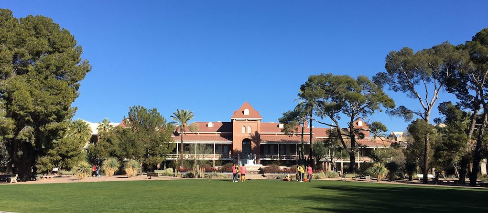

## University of Arizona, Data Science Institute
###  Trainings Program Repository

(University of Arizona Old Main Bldg., Image by Author, CC)

**Welcome to the Spring 2022 DSI Trainings Project for R4R Graduate Students and DSF Postdocs.**

**Coordinators:** Maliaca Oxnam, Holly Ellingson.

***

**Sessions Spring 2022**

| Date | Session 1 | Session 2 |
| :---: | :---       | :---  |
|  Jan 24 - 28 |   Introduction, Expectations |  Present own research |
|Jan 31 - Feb 4   |  [Introduction to Open Science](OpenScience.md) |  [FAIR/CARE](FAIR-CARE.md) |
|  Feb 7 - 11 |  [Project Management Slides](https://drive.google.com/file/d/184BQHtO4H4nJpYUTCm5YRc2tpxiuhjsb/view) | [Project Management](./ProjectManagement.md) |
| Feb 14 - 18   | [Data Management FAIR/CARE](DataManagement.md) |  Statistics Refresher |
|    | [Introduction to Github](https://github.com/clizarraga-UAD7/Workshops/wiki/Introduction-to-Github) / |
| Feb 21 - 25 |  Documentation: [Github Wiki/Github Pages](https://github.com/clizarraga-UAD7/Workshops/wiki/Github-Wikis-and-Github-Pages) |  Documentation: [Github Wikis/Github Pages](https://github.com/clizarraga-UAD7/Workshops/wiki/Github-Wikis-and-Github-Pages) |
| Feb 28 - Mar 4   |  [R Markdown](https://github.com/hidyverse/RMD4HS) | [RMarkdown for Health Scientists](https://hidyverse.github.io/RMD4HS/) |
| Mar 7 - 11   | _**Spring Break**_  | _**Spring Break**_  |
| Mar 14 - 18   |  [Jupyter Notebooks](https://github.com/clizarraga-UAD7/Workshops/wiki/Jupyter-Notebooks) / [Data Cleaning with Pandas](https://github.com/clizarraga-UAD7/Workshops/wiki/Pandas-for-Data-Analysis) | [Exploratory Data Analysis](https://github.com/clizarraga-UAD7/Workshops/wiki/Exploratory-Data-Analysis) |
| Mar 21 - 25   |   [UA HPC Trainings](https://public.confluence.arizona.edu/display/UAHPC/Training)  | [UA HPC User Guide](https://public.confluence.arizona.edu/display/UAHPC/User+Guide) |
|   |  [Intro to HPC Workshop](https://ua-researchcomputing-hpc.github.io/Intro-to-HPC/) | [Introduction to HPC Machine Learning](https://ua-researchcomputing-hpc.github.io/Intro-to-Machine-Learning/)   |
| Mar 28 - Apr 1   | [CyVerse Self Guided Tour](https://cyverse-learning-materials.github.io/cyverse_mooc/)  | [CyVerse Learning Center](https://cyverse-learning-materials.github.io/learning-materials-home/)  |
| Apr 4 - 8    |  [Guide](https://hackmd.io/gzNAPsEqQ5C0Q1TPKSpb4A?view) / [Presentation Slides](https://docs.google.com/presentation/d/1roOozVnRRIiMWrTLZ2gqByH-eGuksJyCY9QEG4dmAHM/edit#slide=id.p) |  [Containers Notes](https://cyverse-learning-materials.github.io/container-camp/)  |
| Apr 11 - 15   |  [The Command Linte Interface](https://github.com/clizarraga-UAD7/Workshops/wiki/The-Command-Line-Interface-Shell) |  [AI/ML Ethics & Applications](https://tinyurl.com/UAD7-EthicsAIML) |
| Apr 18 - 22   | Data Visualization  |   |

***

Created: 02/16/2022 (C. Lizarraga);
Last update: 04/13/2022 (C. Lizarraga)

  [CC BY-NC-SA](https://creativecommons.org/licenses/by-nc-sa/4.0/)

